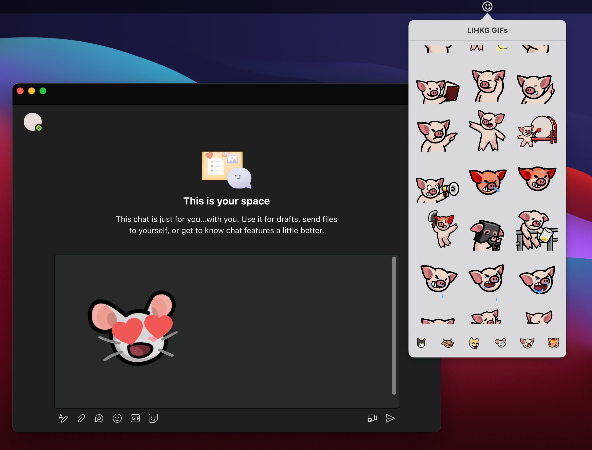

# LIHKG GIFs

A **macOS** menu bar app created for easily sending [LIHKG stickers](https://lihkg.com/stickers) to Microsoft Teams.

This app will try to load a GIF selected by user into the clipboard and simulate keystroke `cmd + v` perform paste automatically.

## How to use
1. Focus on the input area of a Microsoft Teams chat.
2. Click on the app icon and a popover will appear, which display sets of stickers.
3. Click on any of the sticker and you will see it being pasted to the input area of a Microsoft Teams chat.
    * Be-careful that this will clear your clipboard, make sure you have save any important data before selecting a sticker.
    * For first time user, you will see the app requesting for "Accessability" permission, this is required for simulating keystroke `cmd + v` which is the shortcut key for paste.
4. Finally, hit the send button in Microsoft Teams!

## macOS version supported

This app is developed and tested on macOS 12.6. However the minimum deployment target is set to 11.0, so you would still be able to use on a older Mac.

## Available themes

This app supports both light and dark mode, and will apply different themings according to system preferences. 

    

## Note

Copyright of images used in this application, including logos and any trademarks belong to [lihkg.com](https://lihkg.com/) and the author of this application does not own any copyright. This is considered an educational project and the product should be limited to personal use only. Commercial use is strictly prohibited.